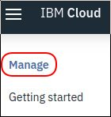

# Mailbox Analyzer

MailBox Analyzer is an application using [Watson Developer Cloud Java SDK](https://github.com/watson-developer-cloud/java-sdk) to demonstrate how to use the [Watson Developer Cloud services](https://www.ibm.com/watson/products-services/), a collection of REST APIs and SDKs that use cognitive computing to solve complex problems.

<br>

## Table of Contents

- [Application Flow](#application-flow)

- [Setup environment in IBM Cloud](#setup-environment-in-ibm-cloud)
  * [Create a credential file](#create-a-credential-file)
  * [Setup Tone Analyzer service](#setup-tone-analyzer-service)
  * [Setup Natural Language Understanding service](#setup-natural-language-understanding-service)
  * [Setup Visual Recognition service](#setup-visual-recognition-service)  

- [Setup application](#setup-application)
  * [Install needed softwares](#install-needed-softwares)
  * [Check everything is installed properly](#check-everything-is-installed-properly)
  * [Login to IBM Cloud](#login-to-ibm-cloud)
 * [Get application code](#get-application-code)  
  * [Install WAS Liberty Kernel](#install-was-liberty-kernel)
  * [Create defaultServer](#create-defaultserver)
  * [Configure defaultServer](#configure-defaultserver)
  * [Add application to defaultServer](#add-application-to-defaultserver)
  * [Set environment to access Watson service instances in IBM Cloud](#set-environment-to-access-watson-service-instances-in-ibm-cloud)
  * [Run application](#run-application)
- [Send your own datas for analysis](#send-your-own-datas-for-analysis)
- [Clean your room](#clean-your-room)
- [About Watson Developer Cloud services being used in the application](#about-watson-developer-cloud-services-being-used-in-the-application)
- [Annexes](#annexes)
  * [Run application elsewhere from IBM Cloud](#run-application-elsewhere-from-ibm-cloud)
     + [Using Resource Group with manual generated service credentials](#using-resource-group-with-manual-generated-service-credentials)
    + [Using Resource Group with auto generated service credentials](#using-resource-group-with-auto-generated-service-credentials)
    + [Using Cloud Foundry](#using-cloud-foundry)
<br>

### Application Flow


<br>

### Setup environment in IBM Cloud

#### Create a credential file


:information_source: Let's store credentials for our 3 services in a json file which our application will use to be granted access.

Choose your favorite text editor, create a new file, paste the following content in it:

```
{
    "0": {
        "credentials": [
          {
        "id": "0",
        "name": "Auto-generated service credentials",
        "apikey": "${TA_APIKEY}",
        "url": "${TA_URL}",
        "role": "Manager"
          }
        ],
        "service": "tone-analyzer",
        "instance": "Tone Analyzer-fs"
      },
      "1": {
        "credentials": [
          {
        "id": "1",
        "name": "Auto-generated service credentials",
        "apikey": "${NLU_APIKEY}",
        "url": "${NLU_URL}",
        "role": "Manager"
          }
        ],
        "service": "natural-language-understanding",
        "instance": "Natural Language Understanding-qf"
      },
      "2": {
        "credentials": [
          {
        "id": "2",
        "name": "Auto-generated service credentials",
        "apikey": "${WVC_APIKEY}",
        "url": "${WVC_URL}",
        "role": "Manager"
          }
        ],
        "service": "watson-vision-combined",
        "instance": "Visual Recognition-gd"
      }
}
```

, save it as **vcap.json** and :warning: **keep it opened**.

<br>

:information_source: Let's create our 3 Watson services


Ctrl + Click on [IBM Cloud Catalog](https://console.bluemix.net/catalog/?category=ai)

<br>

#### Setup Tone Analyzer service

 **Tone Analyzer** uses linguistic analysis to detect three types of tones from communications: emotion, social, and language.  This insight can then be used to drive high impact communications.

To instantiate **Tone Analyzer** service click


Wait for followings panels to be available:


Then hit 


:zzz: When you land on,


:thumbsup: this mean that the **Tone Analyzer** service as been successfully instantiate.

Now to access service credential, on top left click **manage** .



Then click


Copy **API Key:** and paste it in place of **$(TA_APIKEY)** in **vcap.json**

Copy **URL:** and paste it in place of **$(TA_URL)** in **vcap.json**

<br>

#### Setup Natural Language Understanding service

 **Natural Language Understanding** analyze text to extract meta-data from content such as concepts, entities, emotion, relations, sentiment and more.

To instanciate **Natural Language Understanding** service, go back to [IBM Cloud Catalog](https://console.bluemix.net/catalog/?category=ai) and click


Wait for followings panels to be available:


Then hit 


:zzz: When you land on,


:thumbsup: this mean that the **Natural Language Understanding** service as been successfully instantiate.

Now to access service credential, on top left click **manage** .


Then click


Copy **API Key:** and paste it in place of **$(NLU_APIKEY)** in **vcap.json**

Copy **URL:** and paste it in place of **$(NLU_URL)** in **vcap.json**

<br>

#### Setup Visual Recognition service

 **Visual Recognition** find meaning in visual content! Analyze images for scenes, objects, faces, and other content. Choose a default model off the shelf, or create your own custom classifier. Develop smart applications that analyze the visual content of images or video frames to understand what is happening in a scene.

To instanciate **Visual Recognition** service, go back to [IBM Cloud Catalog](https://console.bluemix.net/catalog/?category=ai) and click


Wait for followings panels to be available:


Then hit 


:zzz: When you land on,


:thumbsup: this mean that the **Visual Recognition** service as been successfully instantiate.

Now to access service credential, on top left click **manage** .


Then click


Copy **API Key:** and paste it in place of **$(WVC_APIKEY)** in **vcap.json**

Copy **URL:** and paste it in place of **$(WVC_URL)** in **vcap.json**

> :checkered_flag: You are done with environment setup. Now at least three Watson services should be created.
You can check it in your [IBM Cloud Dashboard](https://console.bluemix.net/dashboard/apps).

<br>


<!--
	ibmcloud catalog search tone
	ibmcloud catalog service tone-analyzer
	ibmcloud resource service-instance-create ta tone-analyzer lite eu-de
	ibmcloud resource service-key-create taKey Manager --instance-name ta
	export TA_APIKEY=$(ibmcloud resource service-key taKey | awk '/^\s*apikey:/ {print $2}') && echo $TA_APIKEY
	export TA_URL=$(ibmcloud resource service-key taKey | awk '/^\s*url:/ {print $2}') && echo $TA_URL
	export TA_METHOD=/v3/tone?version=2017-09-21 && echo $TA_METHOD
	export TA_TEXT="On en a gros !" && echo $TA_TEXT
	jq -n --arg value "$TA_TEXT" '{"text": $value}' | tee ta.req.json | jq .
	curl -X POST -u 'apikey:'$TA_APIKEY -H 'Content-Type: application/json' -H 'Content-Language: fr' -H 'Accept-Language: fr' -d @ta0.req.json $TA_URL$TA_METHOD | tee ta.resp.json | jq .
-->

<!--
	ibmcloud catalog search understanding
	ibmcloud catalog service natural-language-understanding
	ibmcloud resource service-instance-create nlu natural-language-understanding free eu-de	
	ibmcloud resource service-key-create nluKey Manager --instance-name nlu
	export NLU_APIKEY=$(ibmcloud resource service-key nluKey | awk '/^\s*apikey:/ {print $2}') && echo $NLU_APIKEY
	export NLU_URL=$(ibmcloud resource service-key nluKey | awk '/^\s*url:/ {print $2}') && echo $NLU_URL
	export NLU_METHOD=/v1/analyze?version=2018-11-16 && echo $NLU_METHOD
	export NLU_FEATURES='{"sentiment": {}, "keywords": {}, "entities": {}}' && echo "$NLU_FEATURES" | jq .
	export NLU_TEXT="J'aimerai avoir des nouvelles de ma commande passée il y a déjà 15 jours et que je n'ai toujours pas reçu." && echo $NLU_TEXT
	jq -n --argjson features "$NLU_FEATURES" --arg text "$NLU_TEXT" '{"text": $text, "features": $features}' | tee nlu.req.json | jq .
	curl -X POST -u 'apikey:'$NLU_APIKEY -H 'Content-Type: application/json' -d @nlu.req.json $NLU_URL$NLU_METHOD | tee nlu.resp.json | jq .
-->

<!--
	ibmcloud catalog search vision
	ibmcloud catalog service watson-vision-combined
	ibmcloud resource service-instance-create wvc watson-vision-combined lite us-south	
	ibmcloud resource service-key-create wvcKey Manager --instance-name wvc
	export WVC_APIKEY=$(ibmcloud resource service-key wvcKey | awk '/^\s*apikey:/ {print $2}') && echo $WVC_APIKEY
	export WVC_URL=$(ibmcloud resource service-key wvcKey | awk '/^\s*url:/ {print $2}') && echo $WVC_URL
	export WVC_METHOD=/v3/classify?version=2018-03-19 && echo $WVC_METHOD
	export IMG=$(readlink -f image1.jpg) && echo $IMG
	curl -X POST -u 'apikey:'$WVC_APIKEY -H 'Accept-Language: fr' -F 'images_file=@'$IMG $WVC_URL$WVC_METHOD | tee wvc.resp.json | jq .
-->


### Setup application

#### Install needed softwares

> :bulb: Ctrl + Click on links below to open them in new tab and keep the tutorial tab opened.


* Download [latest JDK 8](https://www.oracle.com/technetwork/java/javase/downloads/jdk8-downloads-2133151.html) and install it. 
* Download [WAS Liberty Kernel](https://developer.ibm.com/wasdev/downloads/#asset/runtimes-wlp-kernel) to your **home directory**.
* Download [jq](https://github.com/stedolan/jq/releases/download/jq-1.5/jq-win64.exe), rename it to **jq** and copy it in your %PATH% (e.g. **C:\Windows\System32**).


* Download [latest JDK 8](https://www.oracle.com/technetwork/java/javase/downloads/jdk8-downloads-2133151.html) and install it. 
* Download [WAS Liberty Kernel](https://developer.ibm.com/wasdev/downloads/#asset/runtimes-wlp-kernel) to your **home directory**.
* Download [jq](https://github.com/stedolan/jq/releases/download/jq-1.5/jq-osx-amd64), rename it to **jq**, :warning: set its attribute to executable (e.g. **chmod +x**) and copy it in your $PATH.
<!--
* Download [sponge](https://github.com/bpshparis/CP2019/blob/master/osxtools/sponge) :warning: set its attribute to executable (e.g. **chmod +x**) and copy it in your $PATH.
-->


* Download [latest JDK 8](https://www.oracle.com/technetwork/java/javase/downloads/jdk8-downloads-2133151.html) and install it. 
* Download [WAS Liberty Kernel](https://developer.ibm.com/wasdev/downloads/#asset/runtimes-wlp-kernel) to your **home directory**.
* Get **jq** from your distribution repository or download it from [here](https://github.com/stedolan/jq/releases/download/jq-1.5/jq-linux64), rename it to **jq**, :warning: set its attribute to executable (e.g. **chmod +x**) and copy it in your $PATH.

<br>

:information_source: Most of following steps will be achieved  with command line

command prompt   for  

and shell   for  and  

:bulb: **Keep this command line prompt or shell should opened till the end of the tutorial.**

<br>

#### Check everything is installed properly


Check javac command is available:

	javac -version

Check jq command is available:

	jq

<br>

#### Get application code


Browse [github application repository](https://github.com/bpshparis/murex), download code (e.g. **murex-master.zip**)


and unzip it:

:bulb: Feel free to unzip with any GUI tool but :warning: be sure to unzip in your **home directory**.	

:bulb: You should now have a directory called **murex-master** in your **home directory**.

<br>

#### Install WAS Liberty Kernel

Unzip **wlp-kernel-19.0.0.6.zip**

:bulb: Feel free to unzip with any GUI tool but be sure to unzip in your **home directory**.
	
<br>	

#### Create defaultServer


	cd %HOMEPATH%


	wlp\bin\server.bat create

 

	cd $HOME


	wlp/bin/server create

<br>	

#### Configure defaultServer


	
Edit **wlp/usr/servers/defaultServer/server.xml** and replace it with this section

```
<?xml version="1.0" encoding="UTF-8"?>
<server description="new server">

    <!-- Enable features -->
        <featureManager>
            <feature>servlet-3.0</feature>
        </featureManager>

        <httpEndpoint host="*" httpPort="9080" httpsPort="9443" id="defaultHttpEndpoint"/>
        <application id="app" location="app.war" name="app"/>

</server>
```
then run


	wlp\bin\installUtility.bat install defaultServer

 

	wlp/bin/installUtility install defaultServer

to configure defaultServer.

<br>	
	
#### Add application to defaultServer

 

Create **wlp/usr/servers/defaultServer/apps/app.war.xml** with the following content:
:warning: Substitute **%HOMEPATH%** with the **full path** of your home directory. 
```
<?xml version="1.0" encoding="UTF-8"?>
<archive>
    <dir sourceOnDisk="%HOMEPATH%/murex-master/WebContent" targetInArchive="/"/>
</archive>
```

  

Create **wlp/usr/servers/defaultServer/apps/app.war.xml** with the following content:
:warning: Substitute **$HOME** with the **full path** of your home directory. 
```
<?xml version="1.0" encoding="UTF-8"?>
<archive>
    <dir sourceOnDisk="$HOME/murex-master/WebContent" targetInArchive="/"/>
</archive>
```

#### Set environment to access Watson service instances in IBM Cloud


Save **vcap.json** in **murex-master** directory.


Change to code directory and be sure to stand in the right place


	cd murex-master


	dir


	cd murex-master


	ls -l


> :information_source: If you stand in the correct directory, you should be able to list directories such as **WebContent, src, wlp** and your **vcap.json** completed earlier. 


Now let's format **vcap.json** to fit in one line as required by environment variable syntax and create environment variable call **VCAP_SERVICES**


	jq -c . vcap.json > vcap.env


	set /P VCAP_SERVICES=< vcap.env

 

	jq -c . vcap.json > vcap.env


	export VCAP_SERVICES=$(cat vcap.env)

:bulb: Check the variable with:	


	echo %VCAP_SERVICES%

 
	
	echo $VCAP_SERVICES

It should display something like:

```	
{"0":{"credentials":[{"id":"0","name":"Auto-generated service credentials","apikey":"4Pe0RUDXt......
```
> :checkered_flag: You should now be ready to run the application.

<br>

#### Run application

Come back in your home directory and start WAS Liberty Kernel defaultServer


	cd %HOMEPATH%


	wlp\bin\server.bat start defaultServer

 

	cd $HOME


	wlp/bin/server start defaultServer


Then Ctrl + Click  [app](http://localhost:9080/app)


When app is loaded:

1. Click on  to compose a mail and when done click  to send it to server.
2. Click on  to get your mail from server.
3. Once mails are displayed, click  to send mail for analysis.
4. When Watson returned, **3 new tabs** (one per service) should appear and are ready to browse. 

<br>

### Clean your room

<!--
  

	export APP_NAME=app0 && for svc in ta0 nlu0 dsc0 wvc0; do ibmcloud service unbind ${APP_NAME} $svc; ibmcloud service key-delete -f $svc user0; ibmcloud service delete -f $svc; done && ic app delete ${APP_NAME} -f

-->


Ctrl + Click on [IBM Cloud dashboard](https://console.bluemix.net/dashboard/apps)

Open each services **More Actions** popup menu and choose **Delete Service**


<br>

### About Watson Developer Cloud services being used in the application

 **Tone Analyzer** uses linguistic analysis to detect three types of tones from communications: emotion, social, and language.  This insight can then be used to drive high impact communications.

[Documentation](https://console.bluemix.net/docs/services/tone-analyzer/getting-started.html) 
[Dashboard](https://www.ibm.com/watson/developercloud/dashboard/en/tone-analyzer-dashboard.html) 
[Github](https://github.com/watson-developer-cloud)

 **Natural Language Understanding** analyze text to extract meta-data from content such as concepts, entities, emotion, relations, sentiment and more.

[Documentation](https://console.bluemix.net/docs/services/natural-language-understanding/getting-started.html)
[Dashboard](https://www.ibm.com/watson/developercloud/dashboard/en/natural-language-understanding-dashboard.html)
[Github](https://github.com/watson-developer-cloud)

 **Visual Recognition** find meaning in visual content! Analyze images for scenes, objects, faces, and other content. Choose a default model off the shelf, or create your own custom classifier. Develop smart applications that analyze the visual content of images or video frames to understand what is happening in a scene.

[Documentation](https://console.bluemix.net/docs/services/visual-recognition/getting-started.html)
[Dashboard](https://www.ibm.com/smarterplanet/us/en/ibmwatson/developercloud/dashboard/en/visual-recognition-dashboard.html)
[Github](https://github.com/watson-developer-cloud)
[Tool](https://watson-visual-recognition.ng.bluemix.net/)

<br>

<!--

### Annexes

#### Run application elsewhere from IBM Cloud

##### Using Resource Group with manual generated service credentials

```
#!/bin/sh

output=resources.json

echo '{}' | tee $output

services=$(ibmcloud service list | awk 'NR>6 {print "{\""$2"\":[{\"credentials\":null,\"name\":\""$1"\"}]}"}')

count=$(ibmcloud resource service-instances | awk -F'   ' 'NR>3 {count++} END {print count}') && echo $count " service-instances found."

instances=$(ibmcloud resource service-instances | awk -F'   ' 'NR>3 {print $1 ";;"}')

for i in $(seq 1 $count)
	do
		instance=$(echo $instances | awk -F ';;' '{print $'$i'  }');
		# service=$(echo $service | tr -d '[:space:]');
		instance=$(echo $instance | sed -e 's/^[[:space:]]*//');
		echo "Getting setting for service-instance "$instance;
		obj=$(ibmcloud resource service-instance "$instance" | awk -F ':' '/^ID:/ {print $6 ":" $7 ":" $9}');
		# echo $obj;

		service=$(echo $obj | cut -d':' -f1);
		region=$(echo $obj | cut -d':' -f2);
		id=$(echo $obj | cut -d':' -f3);

		region=$(ibmcloud resource service-instance "$instance" | awk -F ':' '/^ID:/ {print $7}');
		jq --argjson svc "{\"$id\":{\"credentials\":null,\"service\":\"$service\",\"region\":\"$region\",\"instance\":\"$instance\"}}" '. += $svc' $output | sponge $output;


	done

count=$(ibmcloud resource service-keys | awk -F'   ' 'NR>3 {count++} END {print count}') && echo $count " service-keys found."
keys=$(ibmcloud resource service-keys | awk -F'   ' 'NR>3 {print $1 ";;"}')

for i in $(seq 1 $count)
	do
		keyName=$(echo $keys | awk -F ';;' '{print $'$i'  }');
		# service=$(echo $service | tr -d '[:space:]');
		keyName=$(echo $keyName | sed -e 's/^[[:space:]]*//');
		echo "Getting setting for service-key "$keyName;
		obj=$(ibmcloud resource service-key "$keyName" | awk -F ':' '/^ID:/ {print $9 ":" $11}');
		instanceId=$(echo $obj | cut -d':' -f1);
		keyId=$(echo $obj | cut -d':' -f2);
		apikey=$(ibmcloud resource service-key "$keyName" | awk -F ':' '/^\s*apikey:/ {print $2}');
		apikey=$(echo $apikey | tr -d '[:space:]');
		url=$(ibmcloud resource service-key "$keyName" | awk '/^\s*url:/ {print $2}');
		role=$(ibmcloud resource service-key "$keyName" | awk -F ':' '/^\s*iam_role_crn:/ {print $11}');
		role=$(echo $role | tr -d '[:space:]');

		cred='{"id": "'$keyId'", "name": "'$keyName'", "apikey": "'$apikey'", "url": "'$url'", "role": "'$role'"}';

		jq --argjson cred "$cred" 'if (.["'$instanceId'"]) then .["'$instanceId'"].credentials[.["'$instanceId'"].credentials| length] |= . + $cred else . end' $output | sponge $output;

	done

jq . $output

echo ""
echo "!!!! Resources available in " $(readlink -f $output) " !!!!"

# Sample usage:
# jq -r '.[] | select(.instance=="Visual Recognition-cv" and .credentials[1].role=="Writer") | .credentials[1].apikey + ":" + .credentials[1].role' $output


exit 0;
```

##### Using Resource Group with auto generated service credentials

```
#!/bin/bash

input=credentials
output=resourcesAG.json

echo '{}' | tee $output

services=$(ibmcloud service list | awk 'NR>6 {print "{\""$2"\":[{\"credentials\":null,\"name\":\""$1"\"}]}"}')

count=$(ibmcloud resource service-instances | awk -F'   ' 'NR>3 {count++} END {print count}') && echo $count " service-instances found."

instances=$(ibmcloud resource service-instances | awk -F'   ' 'NR>3 {print $1 ";;"}')

for i in $(seq 1 $count)
	do
		instance=$(echo $instances | awk -F ';;' '{print $'$i'  }');
		# service=$(echo $service | tr -d '[:space:]');
		instance=$(echo $instance | sed -e 's/^[[:space:]]*//');
		echo "Getting setting for service-instance "$instance;
		obj=$(ibmcloud resource service-instance "$instance" | awk -F ':' '/^ID:/ {print $6 ":" $7 ":" $9}');
		# echo $obj;

		service=$(echo $obj | cut -d':' -f1);
		region=$(echo $obj | cut -d':' -f2);
		id=$(echo $obj | cut -d':' -f3);

		region=$(ibmcloud resource service-instance "$instance" | awk -F ':' '/^ID:/ {print $7}');
		jq --argjson svc "{\"$id\":{\"credentials\":null,\"service\":\"$service\",\"region\":\"$region\",\"instance\":\"$instance\"}}" '. += $svc' $output | sponge $output;


	done

ibmcloud resource service-key "Auto-generated service credentials" > ./input;

instanceIds=();
keyIds=();
keyNames=();
apikeys=();
urls=();
roles=();

while read LINE
  do
    id=$(echo $LINE | awk -F ':' '/^ID:/ {print $9 ":" $11}');
    instanceId=$(echo $id | cut -d':' -f1);
    if [ ! -z "$instanceId" ]; then
      instanceIds+=($instanceId);
    fi

    keyId=$(echo $id | cut -d':' -f2);
    if [ ! -z "$keyId" ]; then
      keyIds+=($keyId);
    fi

    keyName=$(echo $LINE | awk -F ':' '/^Name:/ {print $2}');
    keyName=$(echo $keyName | sed -e 's/^[[:space:]]*//');
    if [ ! -z "$keyName" ]; then
      keyNames+=("$keyName")
    fi

    apikey=$(echo $LINE | awk -F ':' '/^\s*apikey:/ {print $2}');
		apikey=$(echo $apikey | tr -d '[:space:]');
    if [ ! -z "$apikey" ]; then
      apikeys+=($apikey)
    fi

    url=$(echo $LINE | awk '/^\s*url:/ {print $2}');
    if [ ! -z "$url" ]; then
      urls+=($url)
    fi

    role=$(echo $LINE | awk -F ':' '/^\s*iam_role_crn:/ {print $11}');
    role=$(echo $role | tr -d '[:space:]');
    if [ ! -z "$role" ]; then
      roles+=($role)
    fi

  done < ./input

rm -f ./input;

echo "instanceIds="${instanceIds[@]};
echo "keyNames="${keyNames[@]};
echo "keyIds="${keyIds[@]};
echo "apikeys="${apikeys[@]};
echo "urls="${urls[@]};
echo "roles="${roles[@]};

count=${#apikeys[@]};
echo $count "service-keys found";

for i in $(seq 0 $(($count -1)))
  do
    echo "Getting setting for service-key "${keyNames[$i]};
    cred='{"id": "'${keyIds[$i]}'", "name": "'${keyNames[$i]}'", "apikey": "'${apikeys[$i]}'", "url": "'${urls[$i]}'", "role": "'${roles[$i]}'"}';
    echo $cred;
    jq --argjson cred "$cred" 'if (.["'${instanceIds[$i]}'"]) then .["'${instanceIds[$i]}'"].credentials[.["'${instanceIds[$i]}'"].credentials| length] |= . + $cred else . end' $output | sponge $output;
  done

jq . $output

echo ""
echo "!!!! Resources available in " $(readlink -f $output) " !!!!"

# Sample usage:
# jq -r '.[] | select(.instance=="Visual Recognition-cv" and .credentials[1].role=="Writer") | .credentials[1].apikey + ":" + .credentials[1].role' $output


exit 0;
```

##### Using Cloud Foundry

```
#!/bin/sh

output=vcap.json

echo '{}' | tee $output

services=$(ibmcloud service list | awk 'NR>6 {print "{\""$2"\":[{\"credentials\":null,\"name\":\""$1"\"}]}"}')

for service in $(echo $services)
	do 
		jq --argjson value $service '. += $value' $output | sponge $output; 
	done

for svc in $(ibmcloud service list | awk 'NR>6 {print $1 ":" $2}')
	do
		echo $svc;
		label=$(echo $svc | cut -d':' -f2);
		name=$(echo $svc | cut -d':' -f1);
		echo $label;
		echo $name;
		
		key=$(ibmcloud service key-show $name user0 | awk 'NR>4');
		
		echo $key
		
		jq \
		--arg name $name \
		--arg label $label \
		--argjson clef "$key" \
		'if (.["'$label'"][].name==$name) then .["'$label'"][].credentials = $clef else . end' $output | sponge $output;
	done
	
jq . $output
	
exit 0;
```


​	-->
